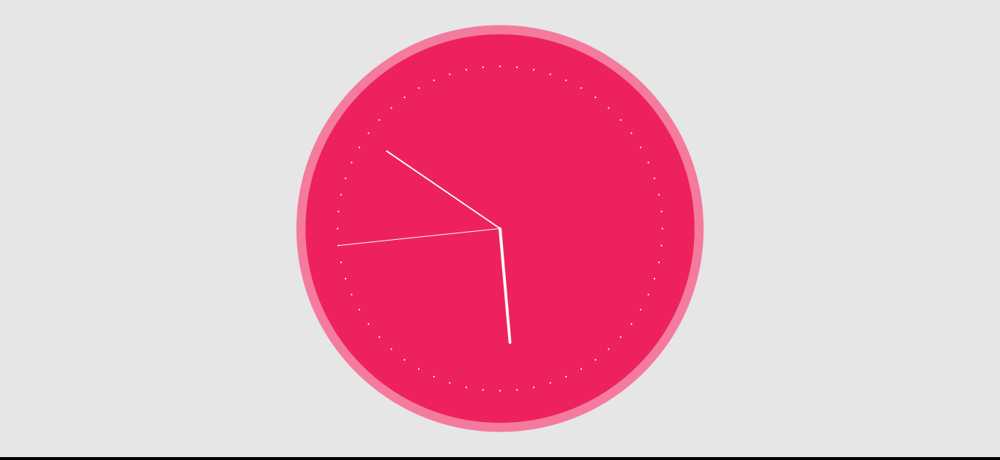
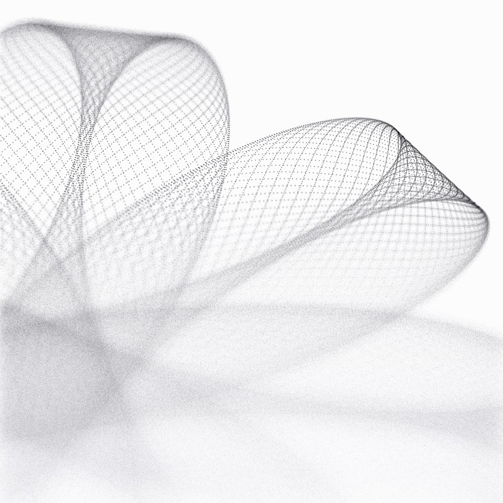

# Clock
The current time can be read with the second(), minute(), and hour() functions. In this example, sin() and cos() values are used to set the position of the hands.



# Pencil Drawing
Pencil drawing, visualization of the beauty of the trigonometric functions.




## Setup
```
% npm install
% npm start
```

Adding `?debug` to the URL will show a parameters pane.

